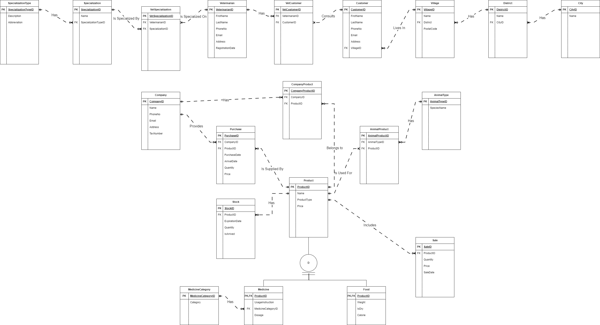

# Healthy Paws - Veteriner Klinik Yönetim Sistemi

## 📌 Proje Tanıtımı

Healthy Paws, bir veteriner kliniğinin operasyonlarını yönetmek için geliştirilmiş bir **ASP.NET Core MVC** uygulamasıdır. Veterinerler, müşteriler, ürünler (ilaç ve mama), stok yönetimi ve satış işlemleri gibi birçok özelliği içinde barındırır. Sistem, **Entity Framework (EF) Core** ile **PostgreSQL** veritabanını kullanır ve kimlik doğrulama için **ASP.NET Core Identity** ile entegre edilmiştir.

## 🏗️ Kullanılan Teknolojiler

- **Backend**: ASP.NET Core MVC, Entity Framework Core
- **Veritabanı**: PostgreSQL
- **Kimlik Doğrulama**: ASP.NET Core Identity
- **Frontend**: Razor Views (CSHTML), Bootstrap
- **Mimari**: MVC (Model-View-Controller)
- **Konteynerizasyon**: Docker, Docker Compose

## ⚙️ Özellikler

### 🔹 Kullanıcı Yönetimi

- ASP.NET Core Identity ile kimlik doğrulama
- Kayıt, giriş ve çıkış işlemleri

### 🔹 Veteriner Klinik Yönetimi

- **Veterinerler**: Uzmanlık yönetimi, müşteri atama, yeni veteriner kayıtları
- **Müşteriler**: Kişisel bilgiler , bağlı veterinerler ve müşteri kayıdı oluşturma
- **Şirketler**: Şirket bilgileri ve sahip oldukları ilaçlar
- **Ürünler**: İlaçlar ve mamalar (kategori bazlı özellikler ile)
- **Stok Yönetimi**: Ürünlerin son kullanma tarihlerini ve miktarlarını takip etme
- **Satış İşlemleri**: Satış kayıtlarının detaylı yönetimi
- **Satın Alım İşlemleri**: Seçilen Şirketin sahip olduğu ilaçlardan satın alımlar
- **Konum Yönetimi**: Şehir, ilçe ve köy bilgileri

## 📂 Veritabanı Şeması

Sistem toplamda 20 tablo içermektedir, bunlardan bazıları:

- **Varlıklar**: `Veterinarian`, `Customer`, `Company`, `Product`, `Stock`, `Sale`
- **İlişkiler**: `VetCustomer` (veteriner-müşteri bağlantısı), `VetSpecialization` (veteriner-uzmanlık bağlantısı)
- **Ürün Kategorileri**: `Medicine`, `Food`, `MedicineCategory`

## 🗂️ Veri Tabanı Modeli
Aşağıda Healthy Paws sisteminin veritabanı ilişkilerini gösteren ER diyagramı bulunmaktadır.



## 🛠 Kurulum ve Çalıştırma

1. **Depoyu Klonlayın:**

   ```bash
   git clone https://github.com/Murat-Ali-Alkan/Healthy-Paws.git
   ```

2. **Docker Kullanarak Uygulamayı Başlatın:**

   - Docker ve Docker Compose'un sisteminizde yüklü olduğundan emin olun.
   - Docker Compose dosyasının bulunduğu dosya dizininde olduğunuzdan emin olun.
   - Aşağıdaki komutu çalıştırarak tüm servisleri başlatın:
     ```bash
     docker-compose up -d --build
     ```

4. **Uygulamayı Açın:**

   - API ve uygulama varsayılan olarak `http://localhost:8080` adresinde çalışacaktır.
   - Uygulamaya Admin olarak girmek için bilgiler: Email address : `admin@healthy.com` , password : `Healthy123$`


## 🏆 Sonuç

Healthy Paws, modern web teknolojileri kullanılarak geliştirilmiş kapsamlı bir veteriner klinik yönetim sistemidir. Modüler yapısı, güvenli kimlik doğrulaması ve kullanıcı dostu arayüzü sayesinde veteriner kliniklerinin operasyonlarını kolaylaştırır.

---

Katkıda bulunmak, hata bildirmek veya geliştirme önerilerinde bulunmak için GitHub deposunda bir issue açabilirsiniz!

